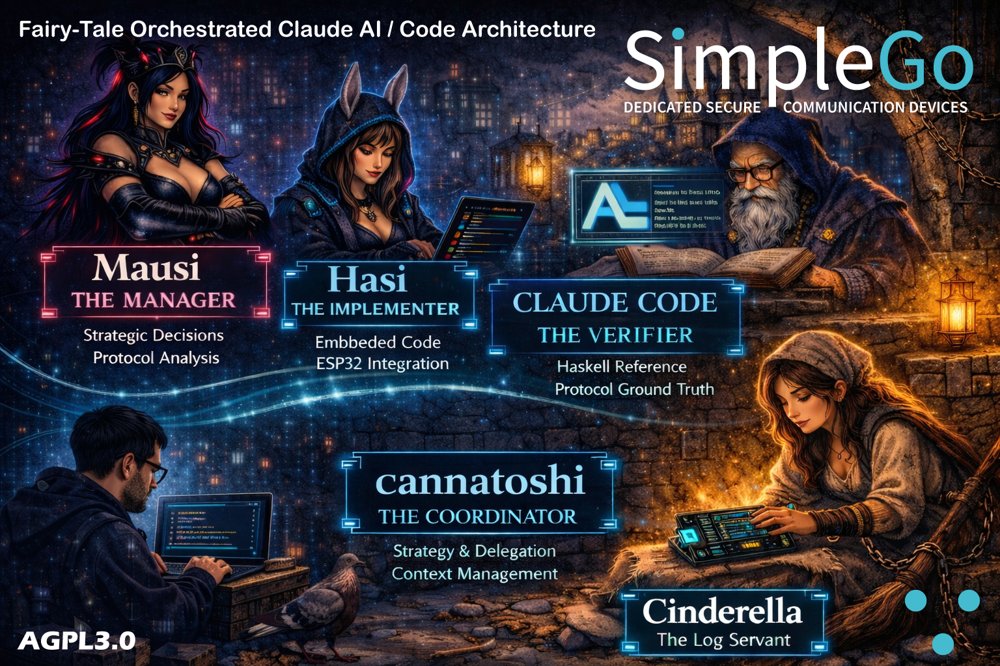

# Quick Reference

## Constants, Wire Formats, Verified Values

**Updated: 2026-02-18 - Session 30 (🔍 Intensive Debug Session)**

---

## Current Status

```
SESSION 30 - 🔍 INTENSIVE DEBUG SESSION
========================================

T5: Keyboard-Send ✅ PASSED
T6: Bidirectional ❌ UNRESOLVED (awaiting Evgeny response)

Session 30 Achievements:
  - 10 hypotheses systematically excluded
  - 14 fixes and diagnostics applied
  - SMP v6 → v7 upgrade (33 bytes saved per transmission)
  - 5 Wizard analyses completed
  - Expert question sent to Evgeny Poberezkin

Problem: App→ESP32 messages never arrive after successful SUB

4 lessons learned, 152 total! 🔍
```

---

## Table of Contents

1. [Version Numbers](#1-version-numbers)
2. [Size Constants](#2-size-constants)
3. [Encoding Reference](#3-encoding-reference)
4. [Wire Formats](#4-wire-formats)
5. [HKDF Chain](#5-hkdf-chain)
6. [Verified Byte-Map](#6-verified-byte-map)
7. [Complete Decryption Chain](#7-complete-decryption-chain)
8. [Crypto Functions](#8-crypto-functions)
9. [Working Code State](#9-working-code-state)
10. [Evgeny Quotes](#10-evgeny-quotes)
11. [Session 19 Key Insights Summary](#11-session-19-key-insights-summary)
12. [Session 20 Key Insights Summary](#12-session-20-key-insights-summary)
13. [Session 21 Key Insights Summary](#13-session-21-key-insights-summary)
14. [Session 22 Key Insights Summary](#14-session-22-key-insights-summary)

---

## 1. Version Numbers (VERIFIED)

| Protocol | Our Value | Hex | Notes |
|----------|-----------|-----|-------|
| SMP Client | 4 | 0x00 0x04 | |
| Agent (Confirmation) | 7 | 0x00 0x07 | AgentConfirmation |
| Agent (Message) | 1 | 0x00 0x01 | AgentMessage (HELLO etc.) — S21 |
| E2E | 2 | 0x00 0x02 | |
| RATCHET_VERSION | **3** | **0x00 0x03** | **Changed v2→v3 in S21!** |
| **version_min (Confirmation)** | **3** | **0x00 0x03** | **Must match RATCHET_VERSION! — S22** |

---

## 2. Size Constants (VERIFIED)

| Structure | v2 Size | v3 Size | v3+PQ Size | Notes |
|-----------|---------|---------|------------|-------|
| EncMessageHeader | 123 | **124** | **~2346** | v3: 2-byte prefixes, v3+PQ: SNTRUP761 — S22 |
| MsgHeader | 88 | 88 | variable | Same (KEM replaces padding), PQ adds KEM data |
| MsgHeader content | 79 | **80** | variable | v3: KEM Nothing adds 1 byte — S21 |
| MsgHeader padding | 7 | **6** | variable | v3: 1 less padding — S21 |
| X448 SPKI | 68 | 68 | 68 | 12 header + 56 raw |
| X25519 SPKI | 44 | 44 | 44 | 12 header + 32 raw |
| cmNonce | 24 | 24 | 24 | In ClientMsgEnvelope |
| Poly1305 MAC | 16 | 16 | 16 | Authentication tag |
| AES-GCM AuthTag | 16 | 16 | 16 | Authentication tag |
| AES-GCM IV | **16** | **16** | **16** | NOT 12! SimpleX uses 16-byte IV |
| Payload AAD | 235 | **236** | **dynamic** | v3: 112 + 124 = 236, v3+PQ: varies — S22 |
| rcAD | 112 | 112 | 112 | our_key1 \|\| peer_key1 (raw X448, no ASN.1) |
| **SNTRUP761 PubKey** | - | - | **1158** | Post-Quantum KEM — S22 |
| **SNTRUP761 Ciphertext** | - | - | **1039** | Post-Quantum KEM — S22 |
| **SNTRUP761 Secret** | - | - | **32** | Post-Quantum shared secret — S22 |

---

## 3. Encoding Reference (from Haskell Source, Verified Session 19-22)

| Primitive | Encoding | Source |
|-----------|----------|--------|
| Word16 | 2 Bytes Big-Endian | Encoding.hs:70-74 |
| Word32 | 4 Bytes Big-Endian | Encoding.hs |
| Char | 1 Byte (B.singleton) | Encoding.hs:52-56 |
| ByteString | 1-Byte Len + Data | Encoding.hs:100-104 |
| Large | 2-Byte Word16 Len + Data | Encoding.hs:132-141 |
| Tail | Rest without length prefix | Encoding.hs:124-130 |
| **Maybe a** | **'0'=Nothing, '1'+data=Just** | Encoding.hs:114-122 |
| AuthTag | 16 Bytes raw (no prefix) | Crypto.hs:956-958 |
| IV | 16 Bytes raw | Crypto.hs:935-937 |
| PublicKey a | ByteString (1-Byte Len + X.509 DER) | Crypto.hs:567-568 |
| Tuple | Simple concatenation | Encoding.hs:184-212 |

### Maybe Encoding (CRITICAL - Session 19)

```
Maybe a:
  Nothing → 0x30 (ASCII '0') — 1 byte only!
  Just a  → 0x31 (ASCII '1') + smpEncode a

NOT binary 0x00/0x01!
```

### PrivHeader Encoding (Updated Session 21)

| Value | Hex | When Used |
|-------|-----|-----------|
| PHConfirmation 'K' | 0x4B | AgentConfirmation with sender auth key |
| PHEmpty '_' | 0x5F | AgentConfirmation without key |
| No PrivHeader | 0x00 | Regular messages (HELLO, chat messages) |

**NOT a standard Maybe encoding!** Custom scheme with 3 values.

### encodeLarge Version Switch (Session 21 — NEW!)

```haskell
encodeLarge v bs
  | v < VersionE2E 3 = smpEncode (Str.length bs :: Word8) <> bs    -- 1 byte max 255
  | otherwise        = smpEncode (Str.length bs :: Word16) <> bs   -- 2 bytes max 65535
```

### KEM Maybe Encoding (Session 22 — NEW!)

```
KEM in MsgHeader:
  Nothing → '0' (0x30) — No PQ KEM active
  Just (Proposed pk) → '1' + 'P' + length_prefix + pubkey_data
  Just (Accepted ct) → '1' + 'A' + length_prefix + ciphertext_data

SNTRUP761 sizes:
  Proposed: '1' + 'P' + [2B len] + 1158 bytes pubkey
  Accepted: '1' + 'A' + [2B len] + 1039 bytes ciphertext
```

---

## 4. Wire Formats (Verified Session 19-22)

### 4.1 unPad Layer (Session 19)

```
[0..1]           originalLength (Word16 Big-Endian)
[2..1+origLen]   ClientMessage (actual content)
[2+origLen..]    Padding (0x23 = '#')
```

### 4.2 ClientMessage

```
ClientMessage = PrivHeader ++ Body (simple concatenation)
smpEncode (ClientMessage h msg) = smpEncode h <> msg
```

### 4.3 AgentConfirmation

```
smpEncode = (agentVersion, 'C', e2eEncryption_, Tail encConnInfo)

Fields:
  agentVersion    Word16 BE = 7    2 bytes
  Tag 'C'         Char             1 byte
  e2eEncryption_  Maybe (...)      1+ bytes
  encConnInfo     Tail             rest
```

### 4.4 AgentMessage / HELLO (Session 21 — NEW!)

```
smpEncode = (agentVersion, smpVersion, prevMsgHash, Tail body)

Fields:
  agentVersion    Word16 BE = 1    2 bytes  ← NOT 2 or 7!
  smpVersion      Word16 BE        2 bytes
  prevMsgHash     Large (Word16)   2+ bytes (empty = [0x00][0x00])
  body            Tail             rest

HELLO Body:
  'H'             HELLO tag        1 byte
  '0'             AckMode_Off      1 byte (0x30, ASCII '0')
```

### 4.5 EncRatchetMessage v3 (Session 21-22 — UPDATED!)

```
encodeEncRatchetMessage v msg =
  encodeLarge v emHeader <> smpEncode (emAuthTag, Tail emBody)

Structure (v3, v >= 3, without PQ):
  emHeader Len    2 bytes Word16 BE   = 124 (0x00 0x7C)
  emHeader        124 bytes           EncMessageHeader
  emAuthTag       16 bytes raw        AES-GCM Auth Tag
  emBody          Tail                rest (encrypted payload)

Structure (v3 with PQ KEM):
  emHeader Len    2 bytes Word16 BE   = ~2346 (variable)
  emHeader        ~2346 bytes         EncMessageHeader with KEM
  emAuthTag       16 bytes raw        AES-GCM Auth Tag
  emBody          Tail                rest (encrypted payload)

Structure (v2, v < 3):
  emHeader Len    1 byte              = 123 (0x7B)
  emHeader        123 bytes           EncMessageHeader
  emAuthTag       16 bytes raw        AES-GCM Auth Tag
  emBody          Tail                rest (encrypted payload)
```

### 4.6 EncMessageHeader v3 (Session 21-22 — UPDATED!)

```
Structure (v3 without PQ, 124 bytes):
  ehVersion       2 bytes          Word16 BE = 3
  ehIV            16 bytes raw     AES-256-GCM IV
  ehAuthTag       16 bytes raw     Header Auth Tag
  ehBody Len      2 bytes Word16   = 88 (0x00 0x58)
  ehBody          88 bytes         encrypted MsgHeader

Structure (v3 with PQ, ~2346 bytes):
  ehVersion       2 bytes          Word16 BE = 3
  ehIV            16 bytes raw     AES-256-GCM IV
  ehAuthTag       16 bytes raw     Header Auth Tag
  ehBody Len      2 bytes Word16   = variable (with KEM data)
  ehBody          variable         encrypted MsgHeader (larger with KEM)

Structure (v2, 123 bytes):
  ehVersion       2 bytes          Word16 BE = 2
  ehIV            16 bytes raw     AES-256-GCM IV
  ehAuthTag       16 bytes raw     Header Auth Tag
  ehBody Len      1 byte           = 88 (0x58)
  ehBody          88 bytes         encrypted MsgHeader
```

### 4.7 MsgHeader v3 (Session 21-22 — UPDATED!)

```
v3 MsgHeader WITHOUT PQ (padded to 88 bytes):
  [Word16 BE]     contentLen = 80
  [Word16 BE]     msgMaxVersion = 2
  [1 byte]        DH key length = 68
  [68 bytes]      msgDHRs SPKI (12 header + 56 raw X448)
  [1 byte]        KEM Nothing = '0' (0x30)     ← NEW in v3!
  [Word32 BE]     msgPN
  [Word32 BE]     msgNs
  [6 bytes]       '#' padding (6× instead of 7× in v2)

v3 MsgHeader WITH PQ (variable size):
  [Word16 BE]     contentLen = variable
  [Word16 BE]     msgMaxVersion
  [1 byte]        DH key length = 68
  [68 bytes]      msgDHRs SPKI
  [1+ bytes]      KEM Just: '1' + state_tag + len_prefix + data
  [Word32 BE]     msgPN
  [Word32 BE]     msgNs
  [variable]      '#' padding

v2 MsgHeader (padded to 88 bytes):
  [Word16 BE]     contentLen = 79
  [Word16 BE]     msgMaxVersion
  [1 byte]        DH key length = 68
  [68 bytes]      msgDHRs SPKI
  [Word32 BE]     msgPN
  [Word32 BE]     msgNs
  [7 bytes]       '#' padding
```

### 4.8 ConnInfo Tags (Session 20)

| Tag | Hex | Constructor | Who Sends | Content |
|-----|-----|-------------|-----------|---------|
| `'I'` | 0x49 | AgentConnInfo | Any sender on Reply Queue | Profile only |
| `'D'` | 0x44 | AgentConnInfoReply | Joiner on Contact Queue | SMP Queues + Profile |

### 4.9 Compressed ConnInfo Format (Session 20)

```
ConnInfo = 'I' <compressed_batch>

compressed_batch:
  'X' (0x58)                    — Compressed marker
  <Word16 BE count>             — NonEmpty list count
  For each item:
    '0' <Tail data>             — Passthrough (≤180 bytes, no compression)
    '1' <Word16 BE len> <data>  — Zstd compressed

Zstd Frame Magic: 28 b5 2f fd (little-endian: 0xFD2FB528)
Max decompressed: 65,536 bytes
Standard Zstd Level 3, no dictionary
```

### 4.10 KEY Command (Session 21)

```
KEY Body:  [corrId][recipientId] KEY [peer_sender_auth_key 44B SPKI]
Signed:    Ed25519 with rcv_auth_private
Server:    Main SSL connection (not peer server)
Response:  OK | ERR AUTH

Source of sender_auth_key:
  PHConfirmation in received AgentConfirmation
  44 bytes Ed25519 SPKI

Status: Functional but NOT REQUIRED (Reply Queues unsecured)
```

### 4.11 SMPQueueInfo Wire Format (Session 22 — NEW!)

```
[1B count] [SMPQueueInfo:]
  [2B clientVersion] [SMPServer:] [1B+N senderId] [1B+44 DH X25519 SPKI] [1B QueueMode 'M']

SMPServer:
  [1B host count] [1B+N hostname] [space] [port_string] [1B+N keyHash]

Example:
  01                              — count: 1 queue
  00 08                           — clientVersion: 8
  02                              — host count: 2
    0D 73 6D 70 31 2E ...         — hostname: "smp1.simplex.im"
    20 35 32 32 33                — space + port: " 5223"
    20 XX XX XX ...               — keyHash: 32 bytes
  08 AA BB CC DD EE FF GG HH      — senderId: 8 bytes
  2C 30 2A 30 05 ...              — DH key: 44 bytes X25519 SPKI
  4D                              — queueMode: 'M' = Messaging

Location: Inside Tag 'D' AgentConnInfoReply (innermost ratchet layer)
```

---

## 5. HKDF Chain (Verified Session 19-22)

### 5.1 HKDF #1: X3DH Initial

```
Salt:   64 × 0x00
IKM:    DH1 || DH2 || DH3 (168 bytes for X448)
Info:   "SimpleXX3DH"
Output: 96 bytes
  [0-31]   hk  = HKs (encrypt our first headers)
  [32-63]  nhk = NHKr (promotes to HKr on first recv)
  [64-95]  sk  = root_key (input for Root KDF)
```

### 5.2 HKDF #2: Root KDF Recv

```
Salt:   sk (32 bytes, Root Key from X3DH)
IKM:    DH(peer_new_pub, our_old_priv) [56 bytes X448]
Info:   "SimpleXRootRatchet"
Output: 96 bytes
  [0-31]   rk1  = new_root_key_1 (input for Root KDF Send)
  [32-63]  ck   = recv_chain_key
  [64-95]  nhk' = new NHKr (next_header_key_recv)
```

### 5.3 HKDF #3: Root KDF Send

```
Salt:   rk1 (32 bytes, from HKDF #2)
IKM:    DH(peer_new_pub, our_NEW_priv) [56 bytes X448]
Info:   "SimpleXRootRatchet"
Output: 96 bytes
  [0-31]   rk2  = new_root_key_2 (final root key)
  [32-63]  ck   = send_chain_key
  [64-95]  nhk' = new NHKs (next_header_key_send)
```

### 5.4 HKDF #4: Chain KDF Recv

```
Salt:   "" (empty!)
IKM:    ck (32 bytes, recv_chain_key from HKDF #2)
Info:   "SimpleXChainRatchet"
Output: 96 bytes
  [0-31]   ck'  = next chain_key
  [32-63]  mk   = message_key (for body decrypt)
  [64-79]  iv1  = BODY IV (NOT header!)
  [80-95]  iv2  = header IV (ignored during decrypt)
```

### 5.5 4 Header Key Architecture (Session 21-22 — UPDATED!)

| Key | Full Name | Usage |
|-----|-----------|-------|
| HKs | header_key_send | Current: encrypt our outgoing headers |
| NHKs | next_header_key_send | Next: will become HKs after our DH ratchet |
| HKr | header_key_recv | Current: decrypt incoming headers |
| NHKr | next_header_key_recv | Next: will become HKr after peer's DH ratchet |

**Initial Assignment from X3DH (CORRECTED Session 22):**
```
HKs  = hk     (HKDF[0-31])   — used for our first send
NHKs = MUST BE STORED IN STATE! (not local variable) — S22 Bug #30
HKr  = (none, NHKr promotes on first recv)
NHKr = nhk    (HKDF[32-63])  — promotes to HKr on first recv
       ↑ This is NHKr, NOT HKr directly! — S22 Bug #30
```

**Promotion on AdvanceRatchet (CORRECTED Session 22):**
```
Receiving: 
  1. HKr ← NHKr (promote old next to current)
  2. rootKdf → new NHKr (derive new next)

Sending:
  1. HKs ← NHKs (promote old next to current)  — S22 Bug #30
  2. rootKdf → new NHKs (derive new next)      — S22 Bug #30
  
NOT: HKs ← KDF output directly (WRONG!)
```

### 5.6 SameRatchet vs AdvanceRatchet (Session 21-22 — UPDATED!)

| Mode | Trigger | DH Step? | Operations |
|------|---------|----------|------------|
| SameRatchet | Same DH key (dh_changed=false) | NO | chainKdf only → mk, ivs |
| AdvanceRatchet | New DH key (dh_changed=true) | YES | 2× rootKdf + chainKdf |

**Header Decrypt Try-Order (CORRECTED Session 22 — Bug #31):**
```
1. Try HKr (SameRatchet) — if success, use SameRatchet mode
2. Try NHKr (AdvanceRatchet) — if success, promote NHKr→HKr, trigger AdvanceRatchet

WRONG: Only trying HKr, using NHKr only as debug fallback
```

---

## 6. Verified Byte-Map (Updated Session 22)

### 6.1 Level 1: E2E Plaintext (15904 Bytes)

```
Offset  Hex         Field                         Status
[0-1]   3a ae       unPad originalLength: 15022   ✅
[2]     4B          PrivHeader 'K' (PHConfirm)    ✅
[3]     2C          Auth Key Length: 44           ✅
[4-47]  30 2a 30..  Ed25519 SPKI Auth Key         ✅
[48-49] 00 07       agentVersion: 7               ✅
[50]    43          'C' = AgentConfirmation       ✅
[51]    30          e2eEncryption_ = Nothing      ✅
```

### 6.2 Level 2: EncRatchetMessage (from Offset 52)

```
Offset  Hex         Field                         Status
[52]    7B          emHeader Length: 123          ✅ (v2, v3=00 7C, v3+PQ=variable)
[53-175]            emHeader (EncMessageHeader):
  [53-54] XX XX       ehVersion: 2                ✅
  [55-70] ...         ehIV (16 Bytes)             ✅
  [71-86] ...         ehAuthTag (16 Bytes)        ✅
  [87]    58          ehBody Length: 88           ✅ (v2, v3=00 58)
  [88-175] ...        ehBody (encrypted MsgHeader) ✅
[176-191]           emAuthTag (16 Bytes)          ✅
[192-15023]         emBody (14832 Bytes)          ✅
```

### 6.3 Level 3: MsgHeader (after Header-Decrypt)

```
Field             Value                           Status
contentLen        79 (v2) / 80 (v3) / var (PQ)   ✅
msgMaxVersion     3 (Peer supports PQ)            ✅
DH Key Len        68 (X448 SPKI)                  ✅
Peer DH Key       c3d0cb637a26c2c8... (56B raw)   ✅
KEM               Nothing ('0') or Just (PQ)     ✅ S21-22
PN                0 (first message)               ✅
Ns                0 (Message #0)                  ✅
Padding           0x23 ('#')                      ✅
```

### 6.4 Level 4: Body Decrypt Intermediate Values (Session 20)

```
root_key:        b0d3fd0e76379553d10718617a973bc69a289c8381ff608f7d1057f292df90dd
dh_secret_recv:  9a66056fff2882bb4690a098ca000b8ac69a0283790ffbfbbb630c20ba3061b1...
new_root_key_1:  82190a059a10b8097355b6a612a1ef21a18b0f46c5ed4c8e066f9c97b90d1e97
recv_chain_key:  747dcc01aa665f0d85295950fdbc4b2fa398cd90615a8f9259efd62ba6318ef5
message_key:     ea8461db5d92ce9f70474bae4d241bca2a99d87cac4ccd48d0af177019b8d44d
iv_body:         a187e7d0636a7e54902a607b05dfbdd8
```

### 6.5 Level 5: ConnInfo Parse (Session 20)

```
Offset  Hex    Field                         Status
[0]     49     'I' — AgentConnInfo Tag       ✅
[1]     58     'X' — Compressed marker       ✅
[2]     01     NonEmpty count: 1             ✅
[3]     31     '1' — Zstd compressed         ✅
[4-5]   22 b1  Zstd data length: 8881       ✅
[6-8886]       Zstd compressed data          ✅

After Zstd decompress: 12268 bytes JSON     ✅
```

### 6.6 Level 5b: AgentConnInfoReply 'D' (Session 22 — NEW!)

```
Tag 'D' = AgentConnInfoReply (from Joiner on Contact Queue)
Contains: SMPQueueInfo (Reply Queue) + Profile

Structure (after ratchet decrypt):
[0]     44     'D' — AgentConnInfoReply Tag
[1...]         SMPQueueInfo (see 4.11)
[...]          ConnInfo Profile (compressed or not)

This is where we get Reply Queue Info for "Connected" status!
```

---

## 7. Complete Decryption/Send Chain (Updated Session 22)

```
RECEIVE CHAIN (all working):
Layer 0: TLS 1.3 (mbedTLS)                                    ✅ Working
  ↓
Layer 1: SMP Transport (rcvDhSecret + cbNonce(msgId))          ✅ Working
  ↓
Layer 2: E2E (e2eDhSecret + cmNonce from envelope)             ✅ Working (S18)
  ↓
Layer 2.5: unPad                                               ✅ Working (S19)
  ↓
Layer 3: ClientMessage Parse                                   ✅ Working (S19)
  ↓
Layer 4: EncRatchetMessage Parse (dynamic KEM)                 ✅ Working (S22)
  ↓
Layer 5: Double Ratchet Header Decrypt (Try-Order fixed)       ✅ Working (S22)
  ↓
Layer 6: Double Ratchet Body Decrypt (dynamic offsets)         ✅ Working (S22)
  ↓
Layer 7: ConnInfo Parse + Zstd                                 ✅ Working (S20)
  ↓
Layer 8: Peer Profile JSON                                     ✅ Working (S20)

SEND CHAIN (Modern Protocol — Reply Queue Flow):
Layer 9a: HELLO Send (NOT NEEDED in modern protocol!)          ✅ Server OK
  ↓
Layer 9b: Reply Queue Info Parse from Tag 'D'                  ❌ MISSING
  ↓
Layer 9c: Reply Queue TLS Connect                              ❌ MISSING
  ↓
Layer 9d: Reply Queue SMP Handshake                            ❌ MISSING
  ↓
Layer 9e: SKEY on Reply Queue                                  ❌ MISSING
  ↓
Layer 9f: AgentConnInfo on Reply Queue                         ❌ MISSING
  ↓
Layer 10: App receives → CON                                   ⏳ Blocked
  ↓
Layer 11: Connection Established ("Connected")                 ⏳ Final Goal
```

---

## 8. Crypto Functions

### 8.1 Header Decrypt (Verified Session 19-22)

```c
// Key: HKr (or NHKr for AdvanceRatchet) — try in order! S22 Bug #31
// IV: ehIV (16 bytes from EncMessageHeader)
// AAD: rcAD (112 bytes = our_key1 || peer_key1)
// Ciphertext: ehBody (88 bytes without PQ, variable with PQ)
// AuthTag: ehAuthTag (16 bytes)
```

### 8.2 Body Decrypt (Verified Session 20-22)

```c
// Key: message_key (32 bytes from Chain KDF [32-63])
// IV: iv_body (16 bytes from Chain KDF [64-79])
// AAD: rcAD[112] || emHeader[dynamic] = 235/236/variable bytes — S22 Bug #29
// Ciphertext: emBody
// AuthTag: emAuthTag (16 bytes)
```

### 8.3 SimpleX Custom XSalsa20 (Session 16)

```
Standard libsodium: HSalsa20(dh_secret, nonce[0:16])
SimpleX:            HSalsa20(dh_secret, zeros[16])  ← ZEROS!
```

### 8.4 Dynamic emHeader Size Calculation (Session 22 — NEW!)

```c
// Read ehVersion to determine size
uint16_t ehVersion = (encrypted[0] << 8) | encrypted[1];
size_t emHeader_size;
if (ehVersion >= 3) {
    // v3: 2-byte length prefix
    emHeader_size = (encrypted[2] << 8) | encrypted[3];
    emHeader_size += 4;  // Include version(2) + prefix(2)
} else {
    // v2: 1-byte length prefix
    emHeader_size = encrypted[2] + 3;  // Include version(2) + prefix(1)
}
```

---

## 9. Working Code State

### 9.1 smp_ratchet.c (Updated Session 22)

```c
#define RATCHET_VERSION         3              // Changed from 2 in S21!
uint8_t em_header[124];                        // 124 bytes in v3 without PQ
em_header[hp++] = 0x00; em_header[hp++] = 0x58; // ehBody-len = 88 (2 BYTES in v3!)
output[p++] = 0x00; output[p++] = 0x7C;        // emHeader len = 124 (2 BYTES in v3!)
// MsgHeader includes KEM Nothing: msg_header[p++] = '0';

// Dynamic KEM parsing (S22)
uint8_t kem_tag = decrypted_header[kem_offset];
if (kem_tag == '0') { /* KEM Nothing */ }
else if (kem_tag == '1') { /* KEM Just — read state_tag and skip data */ }
```

### 9.2 smp_x448.c (Updated Session 22)

```c
// In e2e_encode_params():
buf[p++] = 0x00;
buf[p++] = 0x03;  // version_min = 3 (MUST match RATCHET_VERSION!)
// After key2:
buf[p++] = 0x30;  // KEM Nothing ('0' = 0x30)
```

### 9.3 Header Key Init/Promotion (Session 22 — Bug #30)

```c
// In ratchet_init_sender():
memcpy(ratchet_state.next_header_key_send, hkdf_output + 64, 32);  // SAVE to state!

// In ratchet_x3dh_sender():
memcpy(ratchet_state.next_header_key_recv, nhk, 32);  // NHKr (not HKr!)

// After DH Ratchet Step - PROMOTION:
memcpy(ratchet_state.header_key_send, ratchet_state.next_header_key_send, 32);
memcpy(ratchet_state.next_header_key_send, kdf_output + 64, 32);
```

### 9.4 Header Decrypt Try-Order (Session 22 — Bug #31)

```c
// Try HKr first (SameRatchet)
if (try_header_decrypt(header_key_recv, ...)) {
    decrypt_mode = SAME_RATCHET;
}
// Try NHKr second (AdvanceRatchet)
else if (try_header_decrypt(next_header_key_recv, ...)) {
    decrypt_mode = ADVANCE_RATCHET;
    memcpy(ratchet_state.header_key_recv, ratchet_state.next_header_key_recv, 32);
    // Trigger full DH ratchet step...
}
```

### 9.5 HELLO Format (Session 21)

```c
// PrivHeader: 0x00 (no PrivHeader for regular messages)
// AgentVersion: 0x00 0x01 (version 1, NOT 2 or 7)
// prevMsgHash: 0x00 0x00 (Word16 prefix, empty)
// Body: 'H' '0' (HELLO + AckMode_Off)
// PubHeader: '0' (Nothing, standard Maybe encoding)
// Pad BEFORE encrypt (pad → cbEncrypt)
// DH Key: snd_dh (not rcv_dh)
```

---

## 10. Evgeny Quotes (Authoritative)

**ALWAYS read these before asking Evgeny new questions!**

| # | Date | Quote | Topic |
|---|------|-------|-------|
| 1 | 28.01 | "To your question, most likely A" | Reply Queue E2E Key |
| 2 | 28.01 | "combine your private DH key...with sender's public DH key sent in confirmation header - outside of AgentConnInfoReply but in the same message" | Key Location |
| 3 | 28.01 | "TWO separate crypto_box decryption layers...different keys and different nonces" | Two Layers |
| 4 | 28.01 | "it does seem like you're indeed missing server to client encryption layer" | Missing Layer |
| 5 | 28.01 | "I think the key would be in PHConfirmation, no?" | PHConfirmation |
| 6 | 26.01 | "A_MESSAGE is a bit too broad error" | Error Types |
| 7 | 26.01 | "claude is surprisingly good...Opus 4.5 specifically" | Claude Recommendation |
| 8 | 26.01 | "I'd make an automatic test that tests it against haskell implementation" | Testing |
| 9 | 26.01 | "what you did is impressive...first third-party SMP implementation" | Impressed |

---

## 11. Session 19 Key Insights Summary

1. **unPad Layer** — [2B len][content][padding 0x23...]
2. **PrivHeader** — 'K'=PHConfirmation, '_'=PHEmpty
3. **ClientMessage** — Simple concatenation, no length prefix
4. **Maybe encoding** — '0'=Nothing, '1'=Just (NOT 0x00/0x01!)
5. **AgentConfirmation** — (version, 'C', e2eEncryption_, Tail encConnInfo)
6. **EncRatchetMessage** — v<3: 1-byte len prefix
7. **EncMessageHeader** — [version][IV 16B][AuthTag 16B][len 1B][body 88B]
8. **AES-GCM IV** — 16 bytes (not standard 12!)
9. **X3DH HKDF** — hk[0-31], nhk[32-63], sk[64-95]
10. **rcAD** — our_key1 || peer_key1 (112 bytes)
11. **nhk = header_key_recv** — THE key for header decrypt!

---

## 12. Session 20 Key Insights Summary

1. **Bug #19 Root Cause** — Debug self-decrypt test corrupted ratchet state
2. **DH Ratchet Step = TWO rootKdf calls** — recv chain + send chain
3. **iv1 = Body IV, iv2 = Header IV** — header IV from ehIV, not chainKdf
4. **Body AAD = rcAD || emHeader (raw)** — 112 + 123 = 235 bytes
5. **ConnInfo tag 'I' = AgentConnInfo** — Profile only
6. **ConnInfo tag 'D' = AgentConnInfoReply** — SMP Queues + Profile
7. **Zstd compression** — 'X' marker, '1'=compressed, '0'=passthrough
8. **Zstd magic** — `28 b5 2f fd` (little-endian: 0xFD2FB528)
9. **XInfo Profile** — event "x.info", JSON with displayName
10. **Complete chain verified** — TLS → SMP → E2E → Ratchet → Zstd → JSON

---

## 13. Session 21 Key Insights Summary

1. **ESP32 = Accepting Party, App = Joining Party** — affects key/queue usage
2. **PrivHeader: HELLO=0x00, CONF='K', empty='_'** — 3 values, not standard Maybe
3. **AgentMessage vs AgentConfirmation** — different agentVersion (1 vs 7)
4. **HELLO body** — 'H' + '0' (AckMode_Off), just 2 bytes
5. **prevMsgHash** — Word16 prefix, empty = [0x00][0x00]
6. **DH Keys differ by message type** — rcv_dh for Conf, snd_dh for HELLO
7. **PubHeader Nothing** — '0' (0x30), must be present
8. **KEY command** — optional for unsecured Reply Queues
9. **RSYNC = Ratchet Sync** — crypto decrypt failure indicator
10. **v2/v3 encodeLarge switch** — 1-byte → 2-byte prefix at v≥3
11. **4 Header Keys** — HKs/NHKs/HKr/NHKr with promotion
12. **SameRatchet vs AdvanceRatchet** — chain-only vs full DH ratchet step

---

## 14. Session 22 Key Insights Summary

1. **Modern SimpleX needs NO HELLO** — v2 + senderCanSecure uses Reply Queue flow (CORRECTED S23!)
2. **AgentConnInfo on Reply Queue** — not HELLO on Contact Queue (CORRECTED S23!)
3. **Reply Queue Info in Tag 'D'** — AgentConnInfoReply (innermost layer)
4. **SNTRUP761 for PQ KEM** — not Kyber1024 (1158B pk, 1039B ct, 32B ss)
5. **PQ-Graceful-Degradation** — KEM Nothing → pure DH fallback, no error
6. **version_min MUST match RATCHET_VERSION** — in E2ERatchetParams (Bug #27)
7. **KEM Parser dynamic** — v3+PQ headers up to 2346 bytes (Bug #28)
8. **emHeader size dynamic** — don't hardcode offsets (Bug #29)
9. **NHKs must be stored in state** — not local variable (Bug #30)
10. **nhk from X3DH = NHKr** — promotes to HKr, not direct HKr (Bug #30)
11. **NHKs→HKs promotion chain** — two-step, not direct assignment (Bug #30)
12. **Header decrypt try-order** — HKr first, NHKr second (Bug #31)

---

## 15. Session 23 Key Insights Summary — 🎉 CONNECTED!

1. **ESP32 = Bob (Accepting Party)** — creates Reply Queue, sends Tag 'D'
2. **App = Alice (Initiating Party)** — creates Contact Queue, sends Tag 'I'
3. **Tag 'D' sent BY US** — contains Reply Queue info (Q_B)
4. **Tag 'I' received FROM App** — contains only profile, no queue info
5. **Legacy Path (PHConfirmation 'K')** — requires KEY + HELLO exchange
6. **Modern Path (PHEmpty '_')** — would skip HELLO (but we use Legacy!)
7. **KEY is RECIPIENT command** — signed with rcv_private_auth_key
8. **KEY authorizes SENDER** — App becomes authorized to send on our queue
9. **TLS timeout during processing** — Reply Queue drops, must reconnect
10. **Reconnect sequence** — TLS → SUB → KEY (must re-subscribe!)
11. **Sequence critical: KEY before HELLO** — can't HELLO without authorization
12. **7-step handshake** — exactly 7 steps for Legacy Path connection
13. **CONNECTED needs BOTH HELLOs** — we send on Q_A, App sends on Q_B
14. **Session 22 assumption WRONG** — Legacy Path still needs HELLO!
15. **Verify assumptions with logs** — Tag 'D' branch never triggered!

---

## 16. Complete 7-Step Handshake (Session 23 — Verified Working!)

```
Step   Queue   Direction      Content                           Status
──────────────────────────────────────────────────────────────────────────
1.     —       App            NEW → Q_A, Invitation QR           ✅
2a.    Q_A     ESP32→App      SKEY (Register Sender Auth)        ✅
2b.    Q_A     ESP32→App      CONF Tag 'D' (Q_B + Profile)       ✅
3.     —       App            processConf → CONF Event           ✅
4.     —       App            LET/Accept Confirmation            ✅
5a.    Q_A     App            KEY on Q_A (senderKey)             ✅
5b.    Q_B     App→ESP32      SKEY on Q_B                        ✅
5c.    Q_B     App→ESP32      Tag 'I' (App Profile)              ✅
6a.    Q_B     ESP32          Reconnect + SUB + KEY              ✅
6b.    Q_A     ESP32→App      HELLO                              ✅
6c.    Q_B     App→ESP32      HELLO                              ✅
7.     —       Both           CON — "CONNECTED" 🎉               ✅
```

---

## 17. KEY Command Wire Format (Session 23)

```
KEY Body: "KEY " + senderKey

senderKey:
  [1B len=0x2C] + [44B Ed25519 X.509 SPKI DER]

Full body: "KEY " + 0x2C + peer_sender_auth_key[44]
Total: 4 + 1 + 44 = 49 bytes

Signed with: rcv_private_auth_key (OUR recipient private key!)
This is a RECIPIENT command — we authorize senders on OUR queue.

Server Response:
  OK    → Sender authorized successfully
  ERR   → Authorization failed
```

---

## 18. Session 24 Key Insights Summary — 🏆 First Chat Message!

1. **msgBody must be ChatMessage JSON** — Raw UTF-8 fails with "error parsing chat message"
2. **Session 23 "HELLO on Q_B" was FALSE POSITIVE** — Random 0x48 in ciphertext, not HELLO!
3. **ACK is critical flow control** — Missing ACK blocks ALL further MSG delivery
4. **ACK is Recipient Command** — Signed with rcv_private_auth_key
5. **Response multiplexing** — OK, MSG, END can interleave on subscribed queues
6. **pending_msg buffer needed** — Catch MSG during ACK/SUB reads
7. **PQ-Kyber in wild** — App sends emHeaderLen=2346, graceful degradation works!
8. **Scan-based > Parser-based** — Simple "find OK/MSG" beats offset calculations
9. **One checkmark ≠ delivered** — Server accepted, but not delivered to recipient
10. **App may not fully activate** — Shows "Connected" but doesn't send to Q_B

---

## 19. A_MSG Wire Format (Session 24)

### 19.1 Complete AgentMessage Structure

```
AgentMessage for A_MSG:
Offset  Size   Field               Value/Encoding
──────────────────────────────────────────────────────────
0       1      AgentMessage tag    'M' (0x4D)
1       8      sndMsgId            Int64 BE (8 bytes!)
9       1      prevMsgHash len     0x00 (first) or 0x20 (subsequent)
10      0|32   prevMsgHash data    empty or SHA-256 hash
10|42   1      AMessage tag        'M' (0x4D) for A_MSG
11|43   N      msgBody             ChatMessage JSON (Tail)
```

### 19.2 sndMsgId Encoding

```
sndMsgId = Int64 = 2×Word32 big-endian (8 bytes total!)
NOT Word16 as other fields!

First message: 0x0000000000000001
Second:        0x0000000000000002
...
```

### 19.3 prevMsgHash Encoding

```
First message:
  len = 0x00 (1 byte)
  data = empty (0 bytes)
  
Subsequent messages:
  len = 0x20 (32 decimal)
  data = SHA-256 of previous message (32 bytes)

This is message chaining for integrity!
```

---

## 20. ChatMessage JSON Format (Session 24)

### 20.1 Basic Text Message

```json
{
  "v": "1",
  "event": "x.msg.new",
  "params": {
    "content": {
      "type": "text",
      "text": "Hello from ESP32!"
    }
  }
}
```

Minified (as sent):
```
{"v":"1","event":"x.msg.new","params":{"content":{"type":"text","text":"Hello from ESP32!"}}}
```

### 20.2 Event Types

```
"x.msg.new"      — New message (text, file, image, voice)
"x.msg.update"   — Edit existing message
"x.msg.del"      — Delete message
"x.file"         — File transfer
"x.info"         — System/info message
```

### 20.3 Content Types

```
Text:   {"type": "text", "text": "..."}
File:   {"type": "file", "text": "caption", ...}
Image:  {"type": "image", ...}
Voice:  {"type": "voice", "duration": 5, "text": ""}
```

---

## 21. ACK Protocol (Session 24)

### 21.1 SMP Flow Control

```
1. Server has MSG for queue
2. Client subscribes (SUB)
3. Server delivers MSG, sets delivered=Just(msgId)
4. Server BLOCKS further delivery until ACK
5. Client sends ACK
6. Server clears flag
7. If more messages: delivers next immediately
```

### 21.2 ACK Wire Format

```
ACK body: "ACK " + [1B len][N bytes msgId]

Example:
  msgId = "abc123" (6 bytes)
  body = "ACK " + 0x06 + "abc123"
  
Signed with: rcv_private_auth_key (Recipient Command!)
```

### 21.3 ACK Response

```
"OK"      — Queue now empty, no more messages
"MSG ..." — Next message delivered immediately!

This is why pending_msg buffer is needed!
```

### 21.4 Agent-Level ACK Timing

```
Message Type              ACK Timing
─────────────────────────────────────────────
Confirmation (Tag 'D')    Immediately (auto)
Confirmation (Tag 'I')    Immediately (auto)
HELLO                     Immediately + Delete
A_MSG                     Deferred (app decides)
A_RCVD                    Deferred
A_DEL                     Immediately
```

---

## 22. Response Multiplexing (Session 24)

### 22.1 Problem

```
On subscribed connections, server can send at ANY time:
  - Responses: OK, ERR
  - Notifications: MSG, END

Our code might:
  - Send SUB, expect OK, receive MSG → confused!
  - Send ACK, expect OK, receive MSG → confused!
```

### 22.2 Solution: pending_msg Buffer

```c
// Global buffer for caught messages
static pending_msg_t pending_msg = {0};

// In queue_subscribe():
if (find_in_response("MSG")) {
    store_pending_msg(block, len);  // Save for later
    return true;  // Still success!
}

// In queue_read_raw():
if (pending_msg.has_pending) {
    return_pending();  // Return buffered MSG first
}
return mbedtls_ssl_read(...);
```

### 22.3 Scan-Based Detection

```c
// Simple and reliable (beats complex parsers!)
for (int i = 0; i < len - 2; i++) {
    if (resp[i] == 'M' && resp[i+1] == 'S' && resp[i+2] == 'G') {
        return FOUND_MSG;
    }
}
for (int i = 0; i < len - 1; i++) {
    if (resp[i] == 'O' && resp[i+1] == 'K') {
        return FOUND_OK;
    }
}
```

---

## 23. Session 25 Key Insights — Bidirectional + Receipts

### 23.1 Nonce Offset Discovery

```
Session 24 believed: Byte [12] = corrId tag '0' → use cache
Session 25 discovered: Byte [12] = first nonce byte!

Regular Q_B messages: [12B header][nonce@13][ciphertext]

Brute-force scan proved it:
  for (int offset = 0; offset < 30; offset++) {
      memcpy(nonce, &block[offset], 24);
      ret = crypto_box_open_easy(...);
      if (ret == 0) {
          ESP_LOGI(TAG, "DECRYPT OK at nonce_offset=%d!", offset);
          // → offset=13 works!
      }
  }
```

### 23.2 Ratchet State Persistence

```c
// WRONG — works on copy, changes lost after function returns:
void decrypt_body(...) {
    ratchet_state_t rs = *ratchet_get_state();  // COPY!
    // ... modify rs.chain_key_recv ...
    // rs goes out of scope → changes lost!
}

// CORRECT — works on pointer, changes persist:
void decrypt_body(...) {
    ratchet_state_t *rs = ratchet_get_state();  // POINTER!
    // ... modify rs->chain_key_recv ...
    // Global state updated!
}
```

### 23.3 Chain KDF Skip Calculation

```c
// WRONG — relative calculation:
for (int i = 0; i < (msg_num - rs->msg_num_recv); i++) {
    chain_kdf(...);
}

// CORRECT — absolute calculation:
int skip_from = rs->msg_num_recv;
for (int i = skip_from; i < msg_num; i++) {
    chain_kdf(...);
}
```

### 23.4 Receipt Wire Format

```
A_RCVD ('V') payload:
  [1B 'M' AgentMessage tag]
  [8B sndMsgId Int64 BE]
  [1B prevMsgHash len][0|32B hash]
  [1B 'V' A_RCVD tag]
  [1B count Word8]              ← NOT Word16!
  [AMessageReceipt...]

AMessageReceipt:
  [8B agentMsgId Int64 BE]
  [1B msgHash len][32B SHA256]
  [2B rcptInfo Word16 Large]    ← NOT Word32!

Our mistake: count=Word16 (2B), rcptInfo=Word32 (4B) → +3 bytes
Result: 90 bytes instead of 87 → App reads count=0 → ignores receipt
```

### 23.5 txCount Parser Fix

```c
// WRONG — drops messages after re-SUB:
if (resp[p] != 1) continue;  // Only accepts txCount=1

// CORRECT — accepts any txCount:
uint8_t tx_count = resp[p];  // Just read it
// Server sends txCount=2,3,... after re-SUB
```

### 23.6 Refactoring Result

```
main.c before:  2440 lines (monolith)
main.c after:    611 lines (session loop + init)
Reduction:      −75%

New modules:
  - smp_ack.c/h      52 lines   ACK handling
  - smp_wifi.c/h     65 lines   WiFi initialization
  - smp_e2e.c/h      294 lines  E2E envelope decryption
  - smp_agent.c/h    638 lines  Agent protocol layer
```

---

## 24. Session 26 Key Insights — Persistence

### 24.1 Write-Before-Send Pattern (Evgeny's Golden Rule)

```
Generate key → Persist to flash → THEN send → If response lost → Retry with SAME key

This makes operations IDEMPOTENT.
Without this: response lost → generate NEW key → server/client state desync = FATAL
```

### 24.2 NVS Storage Architecture

```
NVS (Internal Flash, 128KB partition)
├── rat_XX       Ratchet State (520 bytes per contact)
├── queue_our    Queue credentials
├── cont_XX      Contact credentials  
├── peer_XX      Peer connection state

SD Card (External, optional)
├── Message History
├── Contact Profiles
└── File Attachments
```

### 24.3 Capacity Numbers

```
NVS:     128KB → 150+ contacts supported
SD Card: 128GB → 256 million texts, 19 years mixed usage

Ratchet state: 520 bytes each
Write timing:  7.5ms verified (negligible vs network latency)
```

### 24.4 Two-Phase Init (SPI Bus Ownership)

```c
app_main() {
    nvs_flash_init();
    smp_storage_init();        // Phase 1: NVS only
    
    tdeck_display_init();      // Display owns SPI bus
    tdeck_lvgl_init();
    
    smp_storage_init_sd();     // Phase 2: SD on existing bus
}
```

### 24.5 Ratchet Save Points

```
R2: ratchet_init_sender()    After initialized=true
R3: ratchet_encrypt()        After chain_key advance, BEFORE network send
R4/R5: ratchet_decrypt_body() After ADVANCE or SAME state update
```

### 24.6 Boot Restore Sequence

```c
if (smp_storage_exists("rat_00") && smp_storage_exists("queue_our")) {
    ratchet_load_state(0);
    queue_load_credentials();
    contact_load_credentials(0);
    peer_load_state(0);
    // Skip handshake → direct to subscribe + message loop
} else {
    // Fresh start — full handshake
}
```

---

## 25. Session 27 Key Insights — FreeRTOS Architecture

### 25.1 Root Cause: 90KB RAM at Boot

```
Phase 2 commit reserved ~90KB RAM at boot:
  Network Task Stack: 16KB
  App Task Stack:     32KB
  UI Task Stack:      10KB
  Frame Pool:         32KB
  Ring Buffers:       12KB
  ─────────────────────────
  Total:              ~90KB

This starved smp_connect() of memory for TLS/WiFi.
```

### 25.2 Correct Task Startup Timing

```c
// WRONG (Session 27):
app_main() {
    smp_tasks_init();     // Reserves 90KB RAM
    smp_tasks_start();    // Tasks running
    smp_connect();        // Not enough memory!
}

// CORRECT (Session 28):
app_main() {
    smp_connect();        // Full memory available
    smp_tasks_init();     // Now safe to reserve
    smp_tasks_start();    // Tasks take over
}
```

### 25.3 sdkconfig Fixes (Mandatory)

```ini
# Mandatory for 16KB SMP blocks:
CONFIG_MBEDTLS_SSL_OUT_CONTENT_LEN=16384

# Minimum for TLS records > 4096:
CONFIG_LWIP_TCP_SND_BUF_DEFAULT=32768
```

### 25.4 Debugging Lesson

```
Always baseline-test main before debugging feature branch.
Git bisect would have found the breaking commit in minutes, not days.
```

### 25.5 Architecture Design (Valid)

```
3-Task FreeRTOS System:
├── Network Task (Core 0, Priority 7) — TLS read/write
├── App Task (Core 1, Priority 6) — Crypto, protocol, X3DH
└── UI Task (Core 1, Priority 5) — LVGL, keyboard, display

The design is correct. The timing was wrong.
```

---

## 26. Session 28 Key Insights — Phase 2b Success

### 26.1 Task Architecture (Working!)

```
Three FreeRTOS Tasks:
├── Network Task (Core 0, 12KB stack, Priority 7)
├── App Task (Core 1, 16KB stack, Priority 6)
└── UI Task (Core 1, 8KB stack, Priority 5)

Ring Buffers:
├── Network→App: 2KB (PSRAM)
└── App→Network: 1KB (PSRAM)
```

### 26.2 PSRAM Allocation (Critical!)

```c
// Frame Pool — PSRAM
frame_t* pool = heap_caps_calloc(FRAME_POOL_SIZE, sizeof(frame_t), MALLOC_CAP_SPIRAM);

// Ring Buffers — PSRAM
RingbufHandle_t rb = xRingbufferCreateWithCaps(size, RINGBUF_TYPE_NOSPLIT, MALLOC_CAP_SPIRAM);
```

### 26.3 ESP32-S3 Memory Architecture

```
┌─────────────────────────────────────────┐
│  🏆 Internal SRAM (~200KB, ~40KB free)  │
│     mbedTLS (DMA-bound!)                │
│     WiFi/TCP Buffers (DMA!)             │
│     FreeRTOS Kernel                     │
├─────────────────────────────────────────┤
│  📚 PSRAM (8MB, external via SPI)       │
│     Frame Pools, Task Stacks            │
│     Ring Buffers, LVGL Buffers          │
│     Everything that doesn't need DMA    │
├─────────────────────────────────────────┤
│  🔐 NVS Flash (~128KB, persistent)      │
│     Ratchet States, Queue Credentials   │
│     Contact Data, WiFi Credentials      │
└─────────────────────────────────────────┘
```

### 26.4 Critical Lesson: erase-flash

```powershell
# After EVERY branch switch or sdkconfig change:
idf.py erase-flash -p COM6

# Then create new contact in app
```

NVS stores crypto state (ratchet, queues, contacts) that doesn't match after code changes.

### 26.5 New Files (Phase 2b)

```
main/include/smp_events.h      Event types for inter-task communication
main/include/smp_frame_pool.h  Frame pool interface
main/include/smp_tasks.h       Task management interface
main/core/smp_frame_pool.c     Frame pool in PSRAM, sodium_memzero security
main/core/smp_tasks.c          3 tasks, PSRAM stacks + ring buffers
```

---

## 27. Session 29 Key Insights — Multi-Task Architecture

### 27.1 CRITICAL: PSRAM + NVS = CRASH!

```
ESP32-S3: Tasks with PSRAM stack must NEVER write to NVS!

Root Cause:
  - SPI Flash write disables cache
  - PSRAM is cache-based (SPI bus, mapped in cache)
  - Task loses access to its own stack during Flash write

Crash Backtrace:
  app_task → parse_agent_message → ratchet_init_sender 
  → ratchet_save_state → nvs_set_blob → spi_flash_write → CRASH
```

### 27.2 Architecture After Session 29

```
Network Task (Core 0, 12KB PSRAM Stack):
  → smp_read_block(ssl) endless loop
  → Frame → net_to_app Ring Buffer
  → Check app_to_net → ACK/Subscribe via SSL

Main Task (64KB Internal SRAM Stack):
  → smp_app_run() — BLOCKS
  → Read Ring Buffer → Parse → Decrypt
  → NVS persistence (SAFE — Internal SRAM!)
  → 42d handshake

UI Task (Core 1, 8KB PSRAM Stack):
  → Empty loop (next phase)
```

### 27.3 Ring Buffer Sizing

```
NOSPLIT Ring Buffers need ~2.3× payload size!

For 16KB frames:
  - Expected: 16KB + overhead = ~20KB
  - Actual needed: 37KB!
  - FreeRTOS ring buffers have internal overhead
```

### 27.4 Three Separate SSL Connections

```
1. Main SSL (Network Task)     — Subscribe, ACK, server commands
2. Peer SSL (smp_peer.c)       — Chat messages, HELLO, receipts
3. Reply Queue SSL (smp_queue.c) — Queue reads during 42d handshake

Only Main SSL needs task isolation!
```

### 27.5 PSRAM Allocations (Total ~106KB)

```
Frame Pool:           16KB
net_to_app Buffer:    37KB
app_to_net Buffer:     1KB
Net Block Buffer:     16KB
App Parse Buffer:     16KB
Network Task Stack:   12KB
UI Task Stack:         8KB
─────────────────────────────
Total:               ~106KB (1.3% of 8MB PSRAM)
```

---

## 28. Session 30 Key Insights — SMP Wire Format & Debugging

### 28.1 SMP v6 vs v7 Wire Format

```
v6 Block (151 bytes for SUB):
[2B content_length]
[1B tx_count = 0x01]
[2B tx_length]
[1B sigLen = 64]
[64B Ed25519 Signature]
[1B sessIdLen = 32]
[32B SessionId]           ← ONLY in v6, omitted in v7
[1B corrIdLen = 24]
[24B corrId]
[1B entityIdLen = 24]
[24B entityId]
[3B "SUB"]
[padding '#' to 16384]

v7 Block (118 bytes for SUB):
[2B content_length]
[1B tx_count = 0x01]
[2B tx_length]
[1B sigLen = 64]
[64B Ed25519 Signature]
[1B corrIdLen = 24]       ← SessionId missing here (33 bytes saved)
[24B corrId]
[1B entityIdLen = 24]
[24B entityId]
[3B "SUB"]
[padding '#' to 16384]
```

### 28.2 corrId Format (CRITICAL!)

```c
// WRONG (before Session 30):
uint8_t corrId[1] = {'0' + contact_index};

// CORRECT (after Session 30):
uint8_t corrId[24];
esp_fill_random(corrId, 24);

// corrId is reused as NaCL nonce — must be random and unique!
```

### 28.3 Excluded Hypotheses (10 total)

```
1. corrId format      → 24 bytes, server OK, no MSG
2. Batch framing      → correct, verified via hex dump
3. Subscribe failed   → ent_match=1, OK confirmed
4. Delivery blocked   → Wildcard ACK → ERR NO_MSG
5. Network Task crash → Heartbeats every ~30s
6. SSL broken         → RECV logs show active connection
7. SMP v6 issue       → v7 upgrade, problem remains
8. SessionId on wire  → Removed, server happy
9. Response parser    → sessLen removed from 6 parsers
10. ACK chain         → Everything gets ACKed
```

### 28.4 Queue Routing (Wizard Analysis)

```
ESP32 (Inviting Party / Party A):
  rcvQueues: [Q_A on smp1, status=Active]     ← receives from App HERE
  sndQueues: [sq→Q_B on smp19, status=Active]  ← sends to App HERE

App (Joining Party / Party B):
  rcvQueues: [Q_B on smp19, status=Active]     ← receives from ESP32 HERE
  sndQueues: [sq→Q_A on smp1, status=Active]   ← sends to ESP32 HERE
```

### 28.5 Version Negotiation

```
1. Server sends SMPServerHandshake with smpVersionRange (e.g. 6-17)
2. Client calculates intersection with own range
3. Client sends SMPClientHandshake with ONE smpVersion (e.g. 7)
4. Server validates via compatibleVRange'
5. Version stored in THandleParams.thVersion
6. ALPN "smp/1" → full server range; without ALPN → only v6
```

---

## Section 29: Session 31 Key Insights (2026-02-18)

### 29.1 SMP Batch Format (Definitive Reference)

```
Block Structure (16384 bytes total):
┌──────────────────────────────────────────────────┐
│ [2B content_length]  ← Big Endian, payload size  │
│ [1B txCount]         ← Number of transmissions   │
│ [2B tx1_length]      ← Large-encoded TX1 length  │
│ [tx1_data]           ← First transmission        │
│ [2B tx2_length]      ← (if txCount > 1)          │
│ [tx2_data]           ← Second transmission       │
│ [... more TXn]       ← (if txCount > 2)          │
│ [padding '#']        ← Fill to SMP_BLOCK_SIZE    │
└──────────────────────────────────────────────────┘

batch = True is HARDCODED in Transport.hs since v4.
Third-party clients MUST handle txCount > 1.
```

### 29.2 TX2 Forwarding Pattern

```c
// After parsing TX1 from subscribe response:
if (txCount > 1) {
    int tx2_start = 1 + 2 + tx1_len;  // skip txCount + Large + TX1
    int tx2_len = (block[tx2_start] << 8) | block[tx2_start + 1];
    uint8_t *tx2_ptr = &block[tx2_start + 2];
    
    // Repackage as single-TX block for Ring Buffer:
    uint8_t *fwd = block;
    int tx2_total = 1 + 2 + tx2_len;
    fwd[0] = (tx2_total >> 8) & 0xFF;  // content_length
    fwd[1] = tx2_total & 0xFF;
    fwd[2] = 0x01;                      // txCount = 1
    fwd[3] = (tx2_len >> 8) & 0xFF;    // Large-length
    fwd[4] = tx2_len & 0xFF;
    memmove(&fwd[5], tx2_ptr, tx2_len); // memmove! overlap!
    
    xRingbufferSend(net_to_app_buf, fwd, tx2_total + 2, ...);
}
```

### 29.3 Re-Delivery Detection Pattern

```c
// In Double Ratchet decrypt, before chain skip:
if (msg_ns < ratchet->recv) {
    ESP_LOGW("RATCH", "Re-delivery detected: ns=%d < recv=%d",
             msg_ns, ratchet->recv);
    return RE_DELIVERY;  // Caller sends ACK without processing
}
```

### 29.4 TCP Keep-Alive + SMP PING/PONG

```
TCP Keep-Alive (OS level, NAT refresh):
  keepIdle  = 30s   ← seconds before first probe
  keepIntvl = 15s   ← seconds between probes
  keepCnt   = 4     ← failed probes before disconnect
  
  Source: Haskell uses identical values (SimpleX Haskell codebase)

SMP PING/PONG (Application level):
  SimpleX Haskell: PING every 600s (SMP), 60s (NTF)
  SimpleGo:        PING every 30s (more aggressive, safe)
  
  Server does NOT drop subscriptions from missing PING.
  Only after 6 hours without ANY subscription on the connection.
```

### 29.5 Subscription Rules (from Evgeny)

```
1. NEW creates subscribed by default (no SUB needed after NEW)
2. SUB is a noop if already subscribed (but re-delivers last unACKd MSG)
3. Subscription exists on ONE socket only
4. SUB from socket B → socket A gets END
5. Reconnection → old socket gets END → must validate session
6. Reply Queue: must re-SUB on main socket after temporary socket closes
```

### 29.6 Current Architecture (End of Session 31)

```
Boot → WiFi → TLS → SMP v7 Handshake → Subscribe → Tasks

Network Task (Core 0, PSRAM):
  - SSL read loop (1s timeout)
  - TCP Keep-Alive + PING/PONG (30s)
  - subscribe_all_contacts() with txCount > 1 handling
  - TX2 MSG forwarding to App Task
  - Frame → net_to_app_buf Ring Buffer

Main Task (Internal SRAM, 64KB):
  - Ring Buffer read → Parse → Decrypt
  - Re-delivery detection (msg_ns < recv)
  - Keyboard poll (non-blocking)
  - 42d handshake block
  - ACK/Subscribe via Ring Buffer → Network Task

UI Task (Core 1, PSRAM):
  - Empty loop (future LVGL display)
```

### 29.7 Root Cause Summary

```
BUG:   if (rq_resp[rrp] == 1)   ← discards txCount > 1
FIX:   if (rq_resp[rrp] >= 1)   ← accepts batched responses

One character: == → >=
Three weeks of debugging.
"Klassiker." — Mausi 👑🐭
```

---

*Quick Reference v25.0*  
*Last updated: February 18, 2026 - Session 31*  
*Status: 🎉 Bidirectional Chat Restored! Milestone 7!*  
*All 7 Milestones Achieved!*  
*Next: Session 32 — Keyboard, Display, Multiple Contacts*
